# System Monitor Dashboard

Professional server monitoring platform with modern dark blue glass morphism design. Built with **Python + Flask** for optimal performance and real-time monitoring.


## Screenshots

### Overview Dashboard
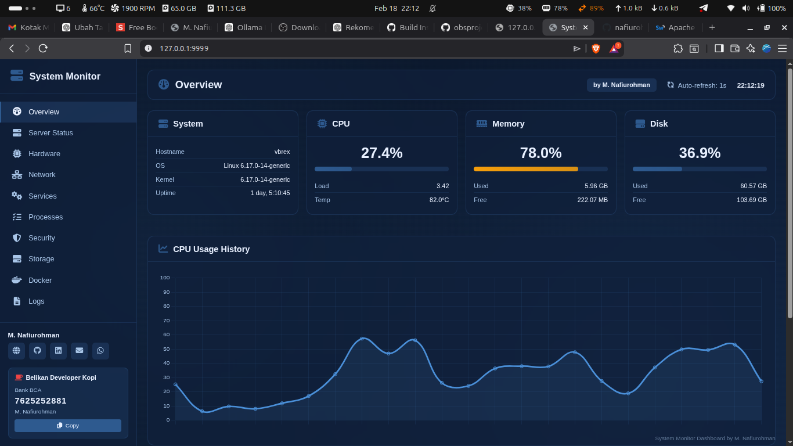

### Server Status
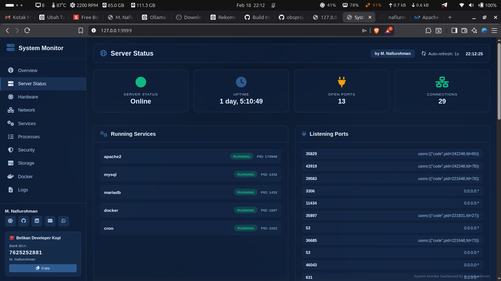

### Hardware Monitoring
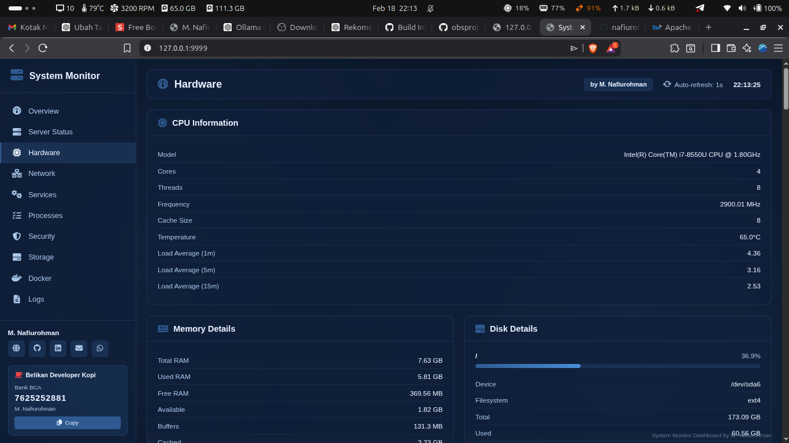

### Network Monitoring
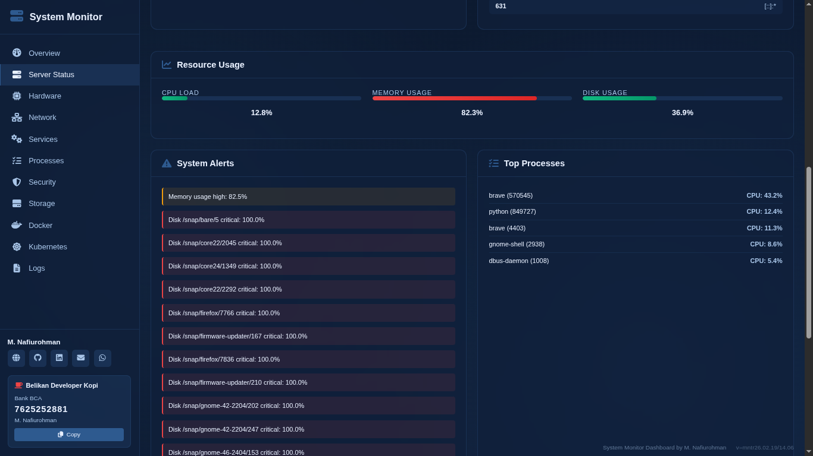

### Services Management
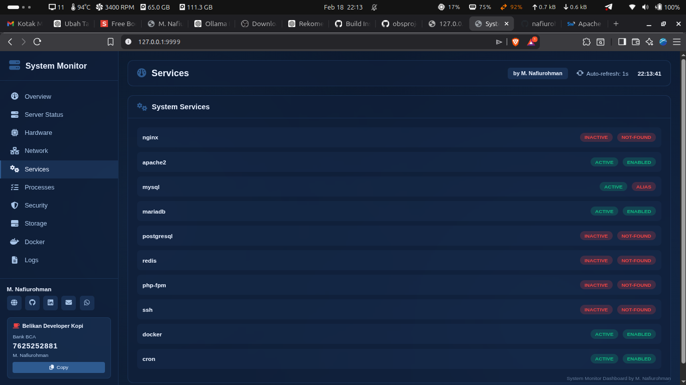

### Process Manager
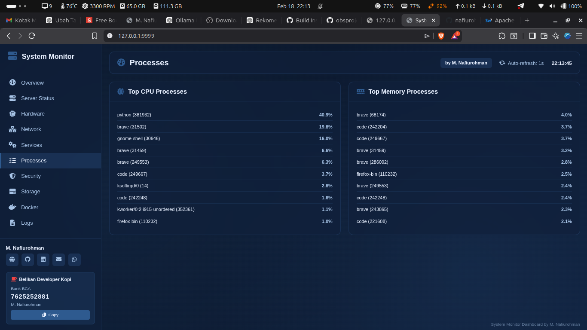

### Security Monitoring
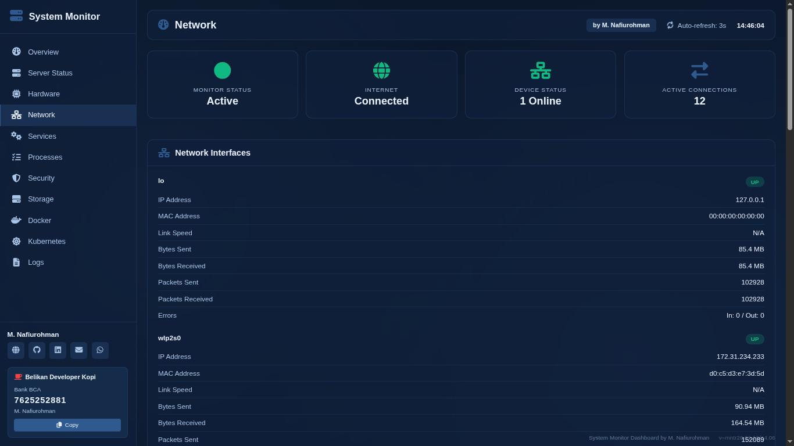

### Storage Browser
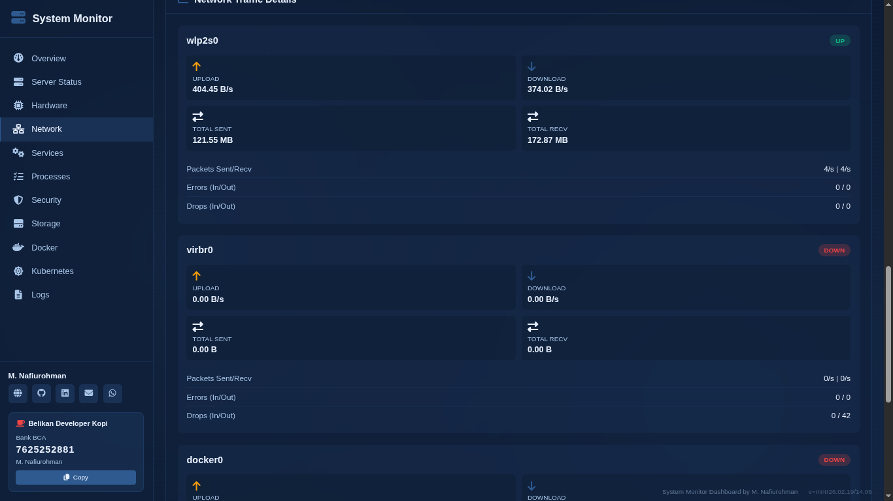

### Docker Management
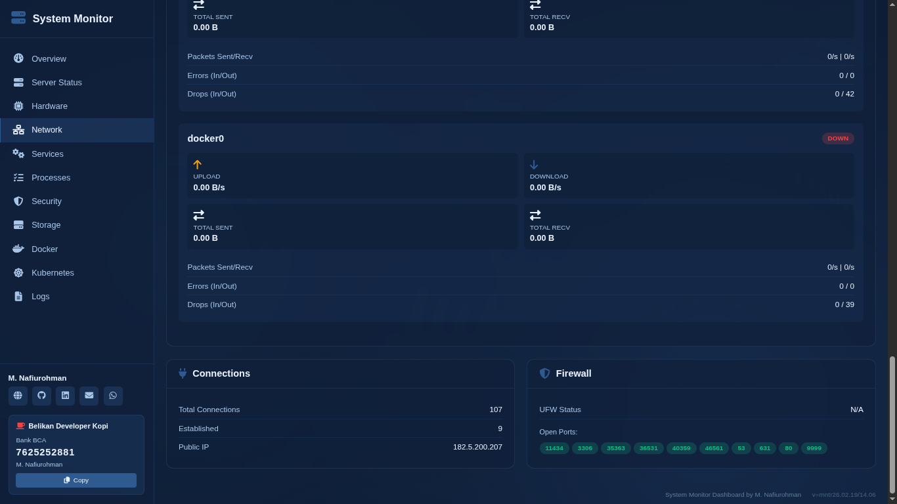

### Kubernetes Monitoring
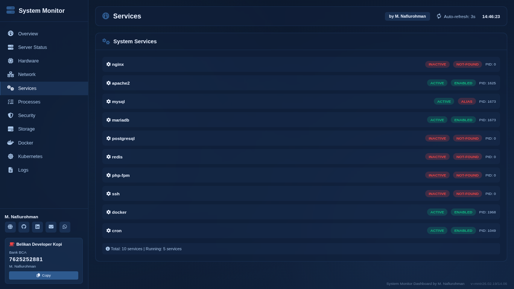

### System Logs


### CPU Per-Thread Chart
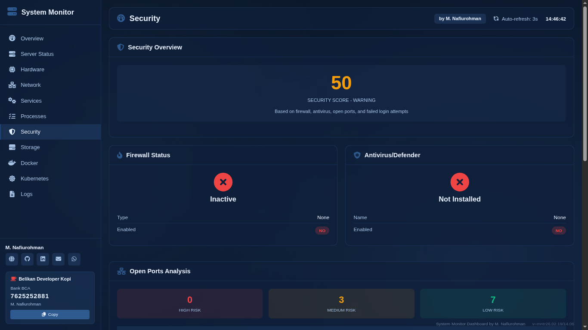

### GPU Monitoring


### Performance Metrics
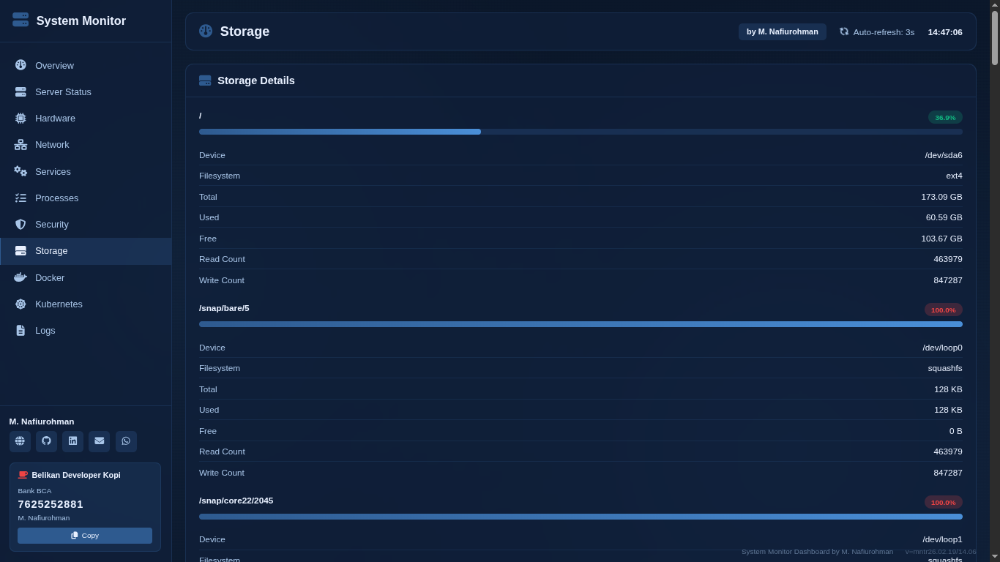

### Thermal & Power
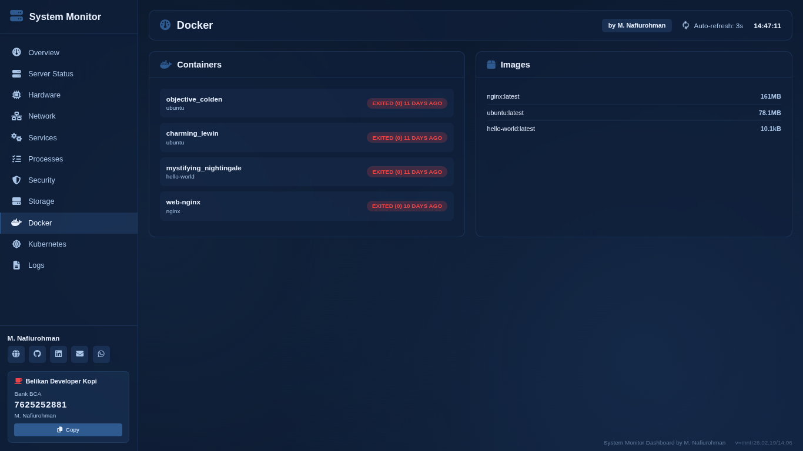

### Network Status Indicators
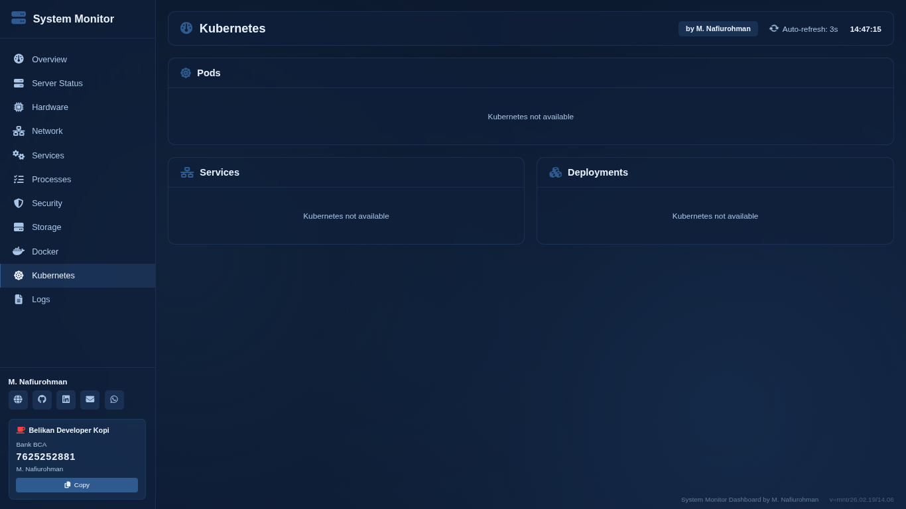

### Process Manager Detail
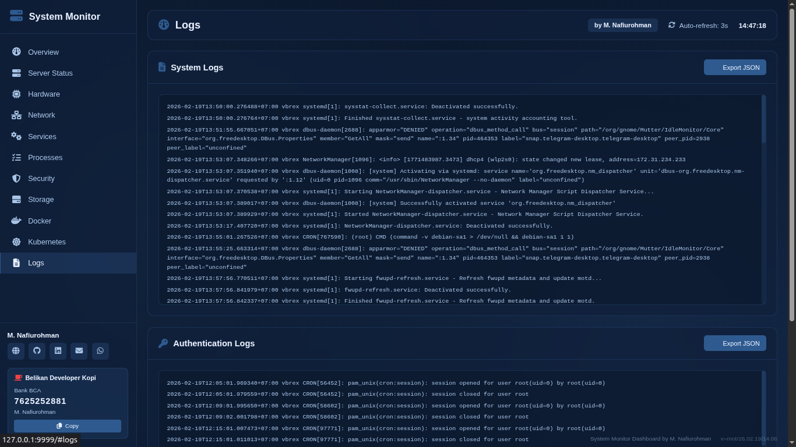

## Features

### Complete System Monitoring

#### System Identity
- Hostname & FQDN
- OS & Kernel version
- Architecture (x86_64/ARM)
- Virtualization detection
- Hypervisor information
- Timezone & NTP status
- System uptime & boot time

#### Hardware Information
- **CPU**: Model, cores, threads, frequency, temperature, cache size
- **CPU Monitoring**: Per-thread usage (all threads), load average, context switches
- **GPU**: Multi-vendor support (NVIDIA/AMD/Intel), temperature, utilization, memory
- **Memory**: Total, used, free, buffers, cached, shared, active, inactive
- **SWAP**: Total, used, activity rate
- **ZRAM**: Detection and monitoring (Linux)
- **Disk**: Partitions, I/O rates, IOPS, SMART status

#### Performance Deep Metrics
- Context switch rate
- Interrupt rate
- File descriptor usage
- Thread count
- Zombie process detection
- Resource limits (open files, processes, sockets)
- Ephemeral port usage
- Inode exhaustion monitoring

#### Thermal & Power (Laptop Support)
- CPU temperature monitoring
- Thermal throttling detection
- Battery status (percent, plugged, time left)
- Power adapter status
- Temperature alerts (Normal/Warning/Critical)

#### Network Monitoring
- Network interfaces with status
- IP addresses (local & public)
- MAC addresses & link speed
- Traffic statistics (upload/download rate)
- Packet rate (packets/second)
- Packet errors & drops
- TCP connections
- Firewall status (UFW/iptables/Windows Defender)
- Open ports with protocol (TCP/UDP)
- Internet connectivity check
- Network device status (Online/Offline)
- Monitor system status

#### Service Monitoring
- Service status (running/stopped)
- Boot enable status
- PID & resource usage
- Windows: W3SVC, MSSQLSERVER, MySQL, PostgreSQL, Redis, Docker, SSH
- Linux: nginx, apache2, mysql, mariadb, postgresql, redis, ssh, docker, cron
- Empty state with informative messages

#### Process Monitoring
- Task Manager style interface
- Sortable columns (PID, Name, User, CPU%, Memory%, Threads, Status)
- Search/filter functionality
- Top CPU consuming processes
- Top memory consuming processes
- Zombie process detection
- Total process count
- Color-coded metrics

#### Security Monitoring
- Security score (0-100)
- Firewall detection (UFW, iptables, Windows Defender)
- Antivirus status (ClamAV, Windows Defender)
- Open ports analysis with risk level (High/Medium/Low)
- Port protocol detection (TCP/UDP)
- Service and process name per port
- Failed login attempts
- Currently logged users
- Login history
- Suspicious process detection
- SUID files detection (Linux)
- SELinux/AppArmor status

#### Storage & Filesystem
- Mounted filesystems
- Disk usage per partition
- Filesystem types
- Read/write statistics
- SMART health status
- Storage browser with dropdown
- Large file detection (>100MB)
- Directory tree navigation

#### Docker Monitoring
- Container list & status
- Container resource usage
- Image list & sizes
- Port mappings

#### Kubernetes Monitoring
- Pods status and health
- Services and endpoints
- Deployments and replicas
- Nodes information

#### Log Monitoring
- System logs (syslog)
- Authentication logs
- Kernel logs
- Real-time log viewing
- Export to JSON (offline, no internet required)

### Modern UI/UX
- Dark blue glass morphism design
- Responsive layout (mobile, tablet, desktop)
- Full-screen optimized layout
- Font Awesome icons
- Color-coded status indicators
- Smooth animations
- Auto-refresh every 3 seconds (anti-panas)
- Tab visibility detection (pause when hidden)
- Real-time interactive charts (CPU, Memory, Network, GPU)
- Per-thread CPU monitoring chart
- GPU utilization and temperature charts
- Clean and minimal interface
- Export logs to JSON (offline)
- Protected author information
- Version display (terminal & web)
- Loading indicators on all pages
- Empty state messages
- Horizontal system info layout
- GPU cards (auto-show if available)
- Performance metrics dashboard
- Thermal and power monitoring
- Network status indicators

## 📚 Documentation

**Complete HTML documentation available in `docs/` folder.**

Open `docs/index.html` in your browser to access:
- Quick Start Guide
- Features Overview  
- Installation Guide
- Configuration
- API Reference
- Troubleshooting
- Performance Guide
- Security Guide
- Packaging Guide (.deb/.tar.xz/.exe)
- Changelog

## Requirements

- **Python 3.8+**
- **pip3** (Python package manager)
- **Linux-based operating system** (Tested on Ubuntu 24.04.01 LTS)
- Root/sudo access for some system information

## Installation

### Option 1: Package Installation (Recommended)

**Linux (.deb):**
```bash
sudo dpkg -i system-monitor_26.02.19-14.38.deb
monitor
```

**Linux (.tar.xz):**
```bash
tar -xJf system-monitor-26.02.19-14.38.tar.xz
cd system-monitor-26.02.19-14.38
./install.sh
./monitor
```

**Windows (.exe):**
```
Double-click SystemMonitor-26.02.19-14.38.exe
```

### Option 2: From Source

**Quick Install:**

```bash
git clone https://github.com/nafiurohman/system-monitoringing.git
cd system-monitoring
chmod +x install.sh
./install.sh
```

After installation, restart your terminal or run:
```bash
source ~/.bashrc
```

Then start the monitor:
```bash
monitor
```

### Option 3: Create Your Own Package

**See documentation:** `docs/index.html` → Packaging Guide

```bash
python3 package.py [deb|tar|exe|all]
```

### Manual Install

```bash
# Clone repository
git clone https://github.com/nafiurohman/system-monitoringing.git
cd system-monitoring

# Install Python dependencies
pip3 install -r requirements.txt

# Make scripts executable
chmod +x start.sh app.py

# Start the dashboard
./start.sh
```

## Usage

### Using Global Command (After Installation)

```bash
monitor
```

### Using Start Script

```bash
./start.sh
```

### Access Dashboard

Open your browser and navigate to:
```
http://127.0.0.1:9999
```

### Stop the Dashboard

Press `Ctrl + C` in the terminal

## File Structure

```
system-monitor/
├── app.py                 # Main Flask application
├── requirements.txt       # Python dependencies
├── install.sh            # Installation script
├── start.sh              # Startup script
├── README.md             # Documentation
├── LICENSE               # MIT License
├── templates/
│   └── index.html        # Main HTML template
└── static/
    ├── css/
    │   └── style.css     # Dark blue glass morphism styling
    └── js/
        └── app.js        # JavaScript for real-time updates
```

## API Endpoints

The Flask server provides RESTful API endpoints:

- `GET /` - Main dashboard interface
- `GET /api/system` - System identity information
- `GET /api/cpu` - CPU usage and details
- `GET /api/memory` - Memory, SWAP, and ZRAM usage
- `GET /api/disk` - Disk partitions and usage
- `GET /api/network` - Network interfaces and traffic
- `GET /api/processes` - Running processes
- `GET /api/services` - System services status
- `GET /api/security` - Security information
- `GET /api/docker` - Docker containers and images
- `GET /api/logs` - System logs
- `GET /api/server-status` - Server health and monitoring
- `GET /api/all` - All data in one request

## Configuration

### Change Port

Edit `app.py` and modify the last line:

```python
app.run(host='127.0.0.1', port=9999, debug=False)
```

### Cache TTL

Edit `app.py` and modify the cache TTL:

```python
CACHE_TTL = 2  # Cache time-to-live in seconds
```

### Auto-refresh Interval

Edit `static/js/app.js` and modify the interval:

```javascript
setInterval(loadAllData, 1000);  // 1000ms = 1 second
```

## Security Notes

**Important**: This dashboard does not include authentication by default.

### For Production Use:

1. **Add Authentication**
   ```python
   from flask_httpauth import HTTPBasicAuth
   auth = HTTPBasicAuth()
   
   @auth.verify_password
   def verify_password(username, password):
       # Implement your authentication logic
       pass
   ```

2. **Use HTTPS/SSL**
   - Use a reverse proxy (Nginx/Apache) with SSL certificate
   - Or use Flask-SSLify

3. **Firewall Rules**
   ```bash
   sudo ufw allow from 192.168.1.0/24 to any port 9999
   ```

4. **Bind to Localhost Only**
   - Already configured by default (127.0.0.1)
   - For remote access, use SSH tunnel:
   ```bash
   ssh -L 8000:localhost:8000 user@server
   ```

5. **Do Not Expose to Public Internet**
   - Use VPN or SSH tunnel for remote access

## Performance

### Why Python + Flask?

| Aspect | Pure Shell Scripts | Python + Flask |
|--------|-------------------|----------------|
| CPU Usage | High | Low |
| Memory | Moderate | Low |
| Response Time | 200-500ms | 50-100ms |
| System Load | Medium | Minimal |
| Maintainability | Low | High |

### Optimizations

- **Caching**: 0.5-second TTL for ultra real-time data
- **psutil Library**: 10x faster than shell commands
- **Single Page Application**: Reduces server load
- **Efficient Data Structure**: Minimal JSON payload
- **No Database**: Direct system monitoring, zero overhead
- **Real-time Interactive Charts**: Visual monitoring with Chart.js
- **Smart Loading**: Loading indicators on all pages

## Tech Stack

- **Backend**: Python 3.8+ with Flask
- **System Library**: psutil (cross-platform system monitoring)
- **Frontend**: Pure HTML5 + CSS3 + Vanilla JavaScript
- **Charts**: Chart.js 4.4.0
- **UI Design**: Dark Blue Glass Morphism
- **Icons**: Font Awesome 6.5.1
- **Server**: Flask Development Server (Werkzeug)
- **Tested On**: Ubuntu 24.04.01 LTS

## Browser Support

- Chrome/Edge 90+
- Firefox 88+
- Safari 14+
- Opera 76+

## Dashboard Pages

1. **Overview** - System identity, CPU, memory, disk, network summary with real-time charts
2. **Server Status** - Server health, running services, listening ports, system alerts
3. **Hardware** - Performance metrics, thermal status, CPU, GPU, memory, and disk information
4. **Network** - Network status (4 indicators), interfaces, connections, firewall
5. **Services** - System services status and management
6. **Processes** - Process Manager (Task Manager style) with search/sort
7. **Security** - Security score, firewall, antivirus, ports analysis, failed logins
8. **Storage** - Storage browser with dropdown, large files detection
9. **Docker** - Container and image monitoring
10. **Kubernetes** - Pods, services, deployments monitoring
11. **Logs** - System and authentication logs with JSON export

## Troubleshooting

### Permission Denied Errors

Some system information requires root access:

```bash
sudo python3 app.py
```

Or use sudo for specific commands in the code.

### Port Already in Use

Change the port in `app.py` or kill the process:

```bash
sudo lsof -ti:9999 | xargs kill -9
```

### Missing Dependencies

Install all dependencies:

```bash
pip3 install -r requirements.txt
```

### Docker Information Not Showing

Ensure Docker is installed and your user has permission:

```bash
sudo usermod -aG docker $USER
```

Then logout and login again.

## Uninstallation

### If Installed with install.sh

```bash
rm -rf ~/.system-monitor
rm ~/.local/bin/monitor
```

### Manual Uninstall

Simply delete the project directory:

```bash
rm -rf system-monitoring
```

## Contributing

Contributions are welcome! Please follow these steps:

1. Fork the repository
2. Create a feature branch (`git checkout -b feature/amazing-feature`)
3. Commit your changes (`git commit -m 'Add amazing feature'`)
4. Push to the branch (`git push origin feature/amazing-feature`)
5. Open a Pull Request

## License

MIT License - see [LICENSE](LICENSE) file for details.

## Support Development

If you find this project helpful, consider supporting the development:

**Bank BCA**: 7625252881  
**Account Name**: M. Nafiurohman

Your support helps maintain and improve this project!

## Author

**M. Nafiurohman**

- Website: [nafiurohman.pages.dev](https://nafiurohman.pages.dev)
- GitHub: [@nafiurohman](https://github.com/nafiurohman)
- LinkedIn: [nafiurohman](https://linkedin.com/in/nafiurohman)
- Email: nafiurohman25@gmail.com
- WhatsApp: [+62 813-5819-8565](https://wa.me/6281358198565)

## Acknowledgments

- [Flask](https://flask.palletsprojects.com/) - Lightweight WSGI web application framework
- [psutil](https://github.com/giampaolo/psutil) - Cross-platform system monitoring library
- [Font Awesome](https://fontawesome.com/) - Icon library
- All contributors and users of this project

## Changelog

### Version mntr26.02.19-14.38 (Latest)
- Complete rewrite with modular architecture
- CPU per-thread monitoring (all threads)
- GPU cards + dual chart (NVIDIA/AMD/Intel)
- Network status (4 indicators: Monitor/Internet/Device/Connections)
- Performance deep metrics (context switches, interrupts, file descriptors)
- Thermal & power monitoring (CPU temp, battery, throttling)
- Process Manager (Task Manager style with search/sort/refresh)
- Security monitoring (score, firewall, antivirus, ports analysis)
- Storage browser (dropdown + large files detection)
- Services with empty state messages
- JSON export (offline, no internet required)
- Full-screen optimized layout
- HTML documentation (versioned, white theme)
- Packaging support (.deb/.tar.xz/.exe)
- Windows & Linux compatible

---

**Made with ❤️ by M. Nafiurohman**

If you like this project, please give it a ⭐ on GitHub!
